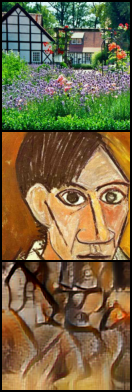
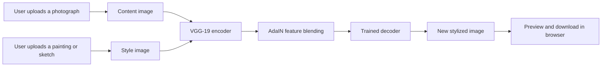
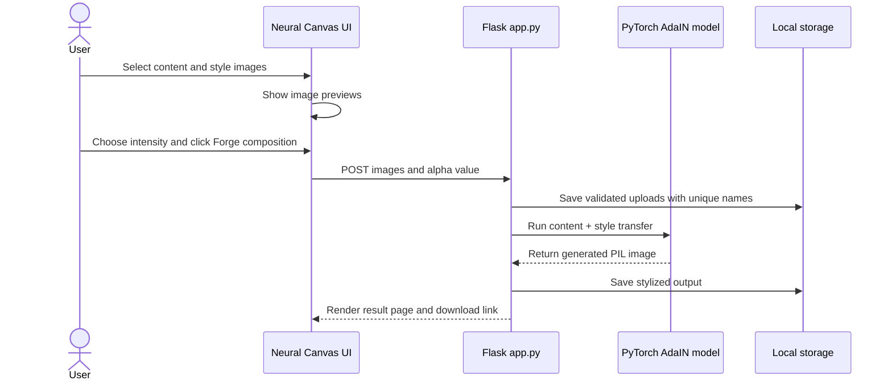
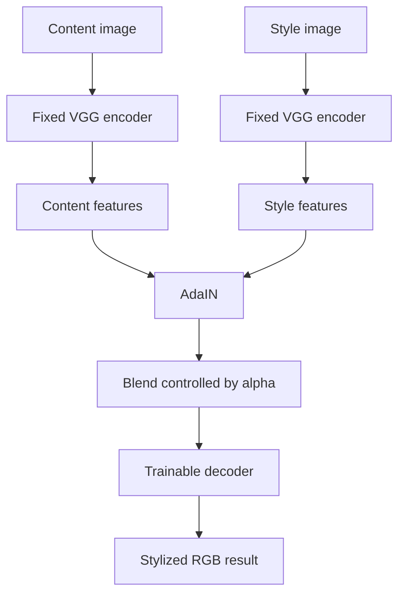
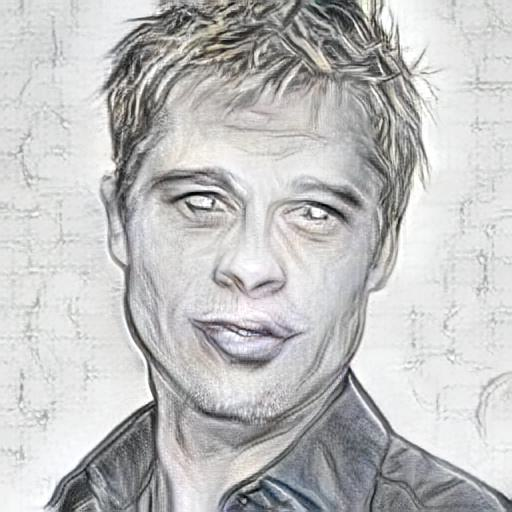

# Neural Canvas: Project Story and Interview Guide

> **One sentence to remember:** Neural Canvas is a local AI application that keeps the subject and layout of one image, then gives it the visual character of another image, such as a painting, sketch, or watercolor.

This guide helps explain the project to people with different levels of technical knowledge. It is written as a speaking aid, not as a script that must be memorized word for word.

---

## 1. Start Here: The 30-Second Explanation

"I built an **AI image transformation tool** called Neural Canvas. A user uploads a normal photograph and a style reference, for example a sketch or a Picasso painting. The model understands the photograph's subject and layout, learns the color and texture pattern from the artwork, and creates a new image that combines them. I built the interface in Flask and the machine-learning pipeline in PyTorch using Adaptive Instance Normalization, or AdaIN. Everything runs locally, so a user's images do not need to be sent to a cloud API."

### The visual idea

| Input | Input | Output |
| --- | --- | --- |
| Content image: **what is in the image** | Style image: **how it should look** | Stylized image: **the combined result** |
| A person's photo | A pencil sketch | The same person rendered like a pencil sketch |



---

## 2. Explain It to Different People

### To a non-technical person

"Think of it as giving a photo a new artistic outfit. The photo provides the person, objects, and scene. The artwork provides the brushstrokes, color mood, and texture. The AI combines them without simply pasting one image on top of the other."

**Avoid saying:** "It copies the painting."

**Better:** "It learns visual patterns from the reference and applies those patterns to a new image."

### To a medical or healthcare professional

"The project is an image-processing demonstration, not a diagnostic or clinical tool. A useful analogy is separating an image into two kinds of information: its **structure** and its **appearance**. The model attempts to preserve the meaningful structure, such as where a face or object is located, while changing appearance characteristics such as texture, contrast, and color distribution. In a clinical setting, this kind of transformation would require strict validation and should never alter diagnostic images or medical evidence."

**Why this framing matters:** Medical imagery contains clinically important details. This application is designed for creative images only, not patient care, diagnosis, or treatment.

### To a teenager learning ML and DL

"A neural network is a program with many learned filters. Early filters notice simple patterns like edges and colors. Deeper filters notice more meaningful patterns, like parts of faces or objects. We send both images through the network. Then we keep the content image's deeper arrangement but adjust it using the style image's texture statistics. A second network turns those adjusted features back into a picture."

### To an interviewer

"I treated it as a complete product, not only a model notebook. I connected a trained PyTorch model to a Flask web application, validated image uploads and the style-strength range, displayed previews, saved outputs with unique filenames, and provided a download flow. I also designed a custom responsive interface around the actual three-step workflow: content image, style reference, and rendered output."

---

## 3. The Big Picture



### The three ideas behind the diagram

1. **Content** is the scene: the person, car, building, or object and where it appears.
2. **Style** is the visual mood: colors, brushstrokes, repeated textures, and contrast.
3. **Transfer** creates a new image that aims to preserve the content while borrowing the style.

---

## 4. A Simple End-to-End Walkthrough

Use this sequence when someone asks, "What happens after I click the button?"

1. The user selects a JPG or PNG content image and a JPG or PNG style image in the browser.
2. The browser shows immediate local previews, so the user can confirm the image pair before processing.
3. Flask receives the files and validates that both are present and have an allowed extension.
4. Flask gives each upload a UUID-based filename, preventing name collisions in `static/uploads/`.
5. The Python inference code converts both images to RGB, resizes them to a practical maximum size of 512 pixels on the longer side, and makes dimensions multiples of 8 for the decoder.
6. A fixed VGG-19 encoder turns each image into feature maps, which are numeric descriptions rather than ordinary pixels.
7. AdaIN adjusts the content feature map to have the style feature map's channel-wise mean and standard deviation.
8. The style-strength slider blends the adjusted features and original content features.
9. A decoder neural network converts the blended features back into an RGB image.
10. Flask saves the result, displays it in the browser, and gives the user a download link.



---

## 5. What the AI Is Actually Doing

### Step A: The encoder reads visual features

The project uses a pretrained **VGG-19** encoder. VGG-19 was originally built for image recognition, but its internal layers are also useful for describing images.

- Shallow layers detect basic details, such as edges and colors.
- Middle layers detect repeated patterns and textures.
- Deeper layers capture a more abstract representation of the image's structure.

In this project, the encoder is **frozen**. Its weights do not change during local fine-tuning. This saves compute and lets the training focus on the decoder.

### Step B: AdaIN mixes the information

AdaIN stands for **Adaptive Instance Normalization**. It is the central technique in this project.

Plain-language version:

1. The model measures the content feature map's typical values and variation.
2. It removes that content-specific distribution temporarily.
3. It applies the style feature map's typical values and variation.
4. The result has the content layout with the style's feature statistics.

The compact mathematical version, only if the audience is technical:

```text
AdaIN(content, style) = style_std * ((content - content_mean) / content_std) + style_mean
```

Here, `mean` and `std` are calculated separately for every feature channel. You do not need to derive the equation in an interview. Say: **"AdaIN normalizes content features and re-scales them with the style features' statistics."**

### Step C: The strength slider gives user control

The UI sends an `alpha` value between `0.0` and `1.0`.

```text
final_features = alpha * stylized_features + (1 - alpha) * content_features
```

| Alpha | Easy explanation |
| ---: | --- |
| `0.0` | Nearly the original photograph |
| `0.3` to `0.6` | A balanced mixture |
| `0.7` to `1.0` | A strong artistic transformation |

### Step D: The decoder paints the result

The decoder is another convolutional neural network. It accepts the blended feature map and reconstructs an RGB image. During training, this is the part that is fine-tuned.



---

## 6. Training Story: How the Decoder Learned

It is important to be accurate here: this repository includes a **compact local fine-tuning workflow**. It uses small included folders for demonstration, not a huge production-scale dataset.

### Training inputs

- `content_data/`: ordinary content images, such as photos and scenes.
- `style_data/`: paintings, sketches, and other style references.
- `models/vgg_normalised.pth`: pretrained VGG-19 encoder weights.
- `models/decoder.pth`: an optional starting decoder checkpoint.

### Training loop in simple terms

1. Pick one content image and one style image.
2. Run both through the frozen encoder.
3. Create an AdaIN target feature representation.
4. Ask the decoder to create an image from that target.
5. Run the generated image through the encoder again.
6. Measure whether it kept the desired content features and style statistics.
7. Update only the decoder so the next result improves.

### The two losses

| Loss | What it encourages | Easy wording |
| --- | --- | --- |
| Content loss | Preserving the subject and scene arrangement | "Keep the photo recognizable." |
| Style loss | Matching statistics across several encoder layers | "Make it feel like the reference artwork." |

The total training loss is the content loss plus the weighted style loss. In the default command, content has weight `1.0` and style has weight `5.0`, so the artistic reference receives greater emphasis.

### Why only train the decoder?

"The encoder already knows useful visual features from prior training. Freezing it avoids relearning image understanding from scratch. I fine-tune the decoder because it is the component responsible for reconstructing the final image. This makes a small local experiment more practical in time, memory, and storage."

---

## 7. Project Architecture

```text
Neural_Style_Transfer/
|
|-- templates/index.html        Custom responsive browser interface
|-- app.py                      Flask routes, validation, upload/result handling
|-- stylize.py                  Reusable inference pipeline and CLI entry point
|-- train.py                    Compact decoder fine-tuning script
|-- utils/models.py             VGG encoder and decoder neural-network definitions
|-- utils/utils.py              AdaIN, feature statistics, dataset transforms
|-- models/                     VGG encoder and initial decoder weights
|-- artifacts/decoder.pth       Decoder checkpoint used by the web app
|-- static/uploads/             User uploads and generated browser results
|-- examples/                   Images shown in the web interface
`-- outputs/                    Generated samples and this guide
```

### Technology choices and why

| Technology | Role | Why it fits |
| --- | --- | --- |
| Python | Core language | Strong ML and web ecosystem |
| PyTorch | Deep-learning framework | Straightforward tensor operations and model loading |
| VGG-19 | Feature encoder | Well-established features for image style transfer |
| AdaIN | Style-transfer method | Supports arbitrary style images without retraining per style |
| Pillow | Image file handling | Opens, converts, resizes, and saves common image types |
| Flask | Web backend | Small, clear app for local file upload and model serving |
| HTML/CSS/JavaScript | User interface | Gives users previews and a simple control surface |
| Gunicorn | Production process server | Runs the Flask application on hosting platforms |

---

## 8. A Good Demo Script

Use clear and well-lit images. The style image should have visually obvious brushwork, color, or texture.

1. Open the app at `http://localhost:5001`.
2. Say: "The left panel is the content image. It defines the subject and composition."
3. Upload a photograph.
4. Say: "The right panel is the style reference. It defines the visual language, not the subject."
5. Upload a painting or sketch.
6. Start with style intensity around `50%` and explain that the slider controls the balance.
7. Click **Forge composition**.
8. When the output appears, point out which details came from the photo and which visual qualities came from the artwork.
9. Download the result.

### Example images already in the project

| Content | Style | Result |
| --- | --- | --- |
|  |  |  |

---

## 9. Common Interview Questions and Strong Answers

### "Is this generative AI?"

"It is a generative image-transformation application. It generates a new image from two user inputs, rather than generating an image only from text. It is not a text-to-image diffusion model; it is an AdaIN neural style-transfer model."

### "Does the AI understand art like a human?"

"No. It does not understand artistic intent or emotion in a human sense. It works with learned visual features and mathematical statistics that correlate with texture, color, and appearance."

### "Why use AdaIN instead of training a model for every artist?"

"AdaIN lets the model accept an arbitrary style image at runtime. The user can supply a new painting or texture without creating and training a separate model for that one style."

### "What happens at 0% style strength?"

"The model feeds the original content features into the decoder, so the result should remain close to the content image. At 100%, it uses the fully style-adjusted feature representation."

### "What was the hardest engineering part?"

"The challenge was connecting an ML inference pipeline to a usable application. The model expects correctly shaped RGB tensors, while users upload many types of image files. I handled conversion, size limits, valid extensions, unique filenames, error feedback, and the result/download flow so the AI feature works as a product."

### "How did you make it efficient?"

"Inference uses `torch.no_grad()` so PyTorch does not store gradients. Images are capped at a 512-pixel long edge and rounded to dimensions compatible with the decoder. The application chooses Apple MPS on compatible Macs, CUDA when available, and otherwise CPU."

### "What would you improve for production?"

"I would add server-side file-size and decoded-image checks, background job processing for long requests, user authentication, rate limiting, cloud/object storage, output history, automated tests, observability, and stricter deployment secrets. For model quality, I would use a larger licensed training set and evaluate perceptual quality across diverse images."

---

## 10. Honest Limitations

Being able to explain limits makes a project discussion stronger.

- A poor, dark, or blurry input photo can create a poor output.
- Very strong styles can distort small details, faces, or text.
- The model transfers broad visual texture and color statistics; it does not precisely reproduce every brushstroke.
- The small included training folders support a learning demonstration, not broad production-grade generalization.
- Runtime depends on image size and available hardware. CPU inference is slower than Apple MPS or CUDA.
- This creative tool must not be used to alter medical images, legal evidence, or other high-stakes imagery.
- Users should only use images they own or have permission to use.

---

## 11. Deployment and Privacy Talking Points

### Local development

The application runs locally at `http://localhost:5001`. Uploads and results are saved in `static/uploads/` on the local machine.

### Deployment

The repository includes a `Procfile` declaring a Gunicorn web process for platforms that provide a `PORT` environment variable. A production deployment should set a strong `FLASK_SECRET_KEY` and add file-size limits, content validation, and secure storage policies.

### Privacy statement you can use

"In the local version, image processing happens on the user's machine. The application does not require a cloud image-generation API after the required model weights are available. If deployed publicly, I would clearly document where uploaded files are stored and how long they are retained."

---

## 12. Final 60-Second Closing Pitch

"Neural Canvas is an end-to-end neural style-transfer project. It takes a content image and a style reference, uses a frozen VGG-19 network to extract visual features, applies Adaptive Instance Normalization to combine content structure with style statistics, and uses a trained decoder to reconstruct a new image. I exposed that model through a Flask application with upload validation, image previews, a style-intensity control, unique file handling, output display, and download support. The result is a local, interactive application that makes a deep-learning concept understandable and usable for non-technical users."

---

## 13. Fast Revision Card

```text
Problem:      Let people artistically transform their own images.
Inputs:       Content image + style image + strength slider.
Core method:  VGG-19 encoder -> AdaIN -> decoder.
Content:      Subject and layout.
Style:        Color, texture, brushwork, visual mood.
Training:     Freeze encoder; fine-tune decoder with content and style loss.
Backend:      Flask validates, saves, runs inference, returns result.
Frontend:     Responsive upload UI, previews, intensity control, download.
Privacy:      Local by default; no cloud image API required.
Limit:        Creative image tool only, not for medical or high-stakes imagery.
```

## 14. References

- Huang, X. and Belongie, S. *Arbitrary Style Transfer in Real-time with Adaptive Instance Normalization.*
- Official AdaIN implementation and pretrained weights: https://github.com/naoto0804/pytorch-AdaIN
- The repository's local reference papers and AdaIN diagram: `../research_docs/`
